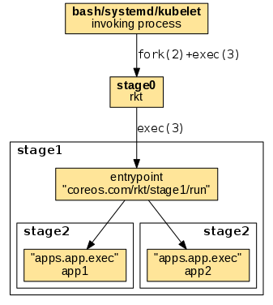
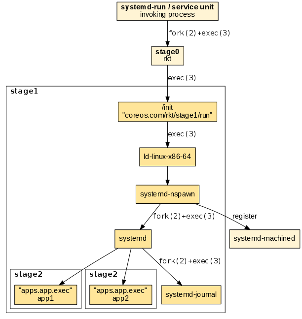
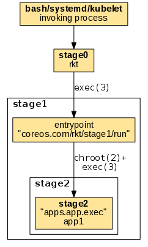

# rkt architecture

## Overview

rkt's primary interface is a command-line tool, `rkt`, which does not require a long running daemon.
This architecture allows rkt to be updated in-place without affecting application containers which are currently running.
It also means that levels of privilege can be separated out between different operations.

All state in rkt is communicated via the filesystem.
Facilities like file-locking are used to ensure co-operation and mutual exclusion between concurrent invocations of the `rkt` command.

## Stages

Execution with rkt is divided into several distinct stages.

**NB** The goal is for the ABI between stages to be relatively fixed, but while rkt is still under heavy development this is still evolving.

After calling `rkt` the execution chain follows the numbering of stages, having the following general order:



1. invoking process -> stage0:
The invoking process uses its own mechanism to invoke the rkt binary (stage0). When started via a regular shell or a supervisor, stage0 is usually forked and exec'ed becoming a child process of the invoking shell or supervisor.

2. stage0 -> stage1:
An ordinary `exec(3)` is being used to replace the stage0 process with the stage1 entrypoint. The entrypoint is referenced by the `coreos.com/rkt/stage1/run` annotation in the stage1 image manifest.

3. stage1 -> stage2:
The stage1 entrypoint uses its mechanism to invoke the stage2 app executables. The app executables are referenced by the `apps.app.exec` settings in the stage2 image manifest.

The details of the execution flow varies across the different stage1 implementations.

### Stage 0

The first stage is the actual `rkt` binary itself.
When running a pod, this binary is responsible for performing a number of initial preparatory tasks:

- Fetching the specified ACIs, including the stage1 ACI of --stage1-{url,path,name,hash,from-dir} if specified.
- Generating a Pod UUID
- Generating a Pod Manifest
- Creating a filesystem for the pod
- Setting up stage1 and stage2 directories in the filesystem
- Unpacking the stage1 ACI into the pod filesystem
- Unpacking the ACIs and copying each app into the stage2 directories

Given a run command such as:

```
# rkt run app1.aci app2.aci
```

a pod manifest compliant with the ACE spec will be generated, and the filesystem created by stage0 should be:

```
/pod
/stage1
/stage1/manifest
/stage1/rootfs/init
/stage1/rootfs/opt
/stage1/rootfs/opt/stage2/${app1-name}
/stage1/rootfs/opt/stage2/${app2-name}
```

where:

- `pod` is the pod manifest file
- `stage1` is a copy of the stage1 ACI that is safe for read/write
- `stage1/manifest` is the manifest of the stage1 ACI
- `stage1/rootfs` is the rootfs of the stage1 ACI
- `stage1/rootfs/init` is the actual stage1 binary to be executed (this path may vary according to the `coreos.com/rkt/stage1/run` annotation of the stage1 ACI)
- `stage1/rootfs/opt/stage2` are copies of the unpacked ACIs

At this point the stage0 execs `/stage1/rootfs/init` with the current working directory set to the root of the new filesystem.

### Stage 1

The next stage is a binary that the user trusts, and has the responsibility of taking the pod filesystem that was created by stage0, create the necessary container isolation, network, and mounts to launch the pod.
Specifically, it must:

- Read the Image and Pod Manifests. The Image Manifest defines the default `exec` specifications of each application; the Pod Manifest defines the ordering of the units, as well as any overrides.
- Set up/execute the actual isolation environment for the target pod, called the "stage1 flavor". Currently there are three flavors implemented:
  - fly: a simple chroot only environment.
  - systemd/nspawn: a cgroup/namespace based isolation environment using systemd, and systemd-nspawn.
  - kvm: a fully isolated kvm environment.

### Stage 2

The final stage, stage2, is the actual environment in which the applications run, as launched by stage1.

## Flavors
### systemd/nspawn flavors

The "host", "src", and "coreos" flavors (referenced to as systemd/nspawn flavors) use  `systemd-nspawn`, and `systemd` to set up the execution chain.
They include a very minimal systemd that takes care of launching the apps in each pod, apply per-app resource isolators and makes sure the apps finish in an orderly manner.

These flavors will:
- Read the image and pod manifests
- Generate systemd unit files from those Manifests
- Create and enter network namespace if rkt is not started with `--net=host`
- Start systemd-nspawn (which takes care of the following steps)
    - Set up any external volumes
    - Launch systemd as PID 1 in the pod within the appropriate cgroups and namespaces
    - Have systemd inside the pod launch the app(s).

This process is slightly different for the qemu-kvm stage1 but a similar workflow starting at `exec()`'ing kvm instead of an nspawn.

We will now detail how the starting, shutdown, and exist status collection of the apps in a pod are implemented internally.


There's a systemd rkt apps target (`default.target`) which has a [*Wants*](http://www.freedesktop.org/software/systemd/man/systemd.unit.html#Wants=) and [*After*](http://www.freedesktop.org/software/systemd/man/systemd.unit.html#Before=) dependency on each app's service file, making sure they all start.

Each app's service has a *Wants* dependency on an associated reaper service that deals with writing the app's status exit.
Each reaper service has a *Wants* and *After* dependency with a shutdown service that simply shuts down the pod.

The reaper services and the shutdown service all start at the beginning but do nothing and remain after exit (with the [*RemainAfterExit*](http://www.freedesktop.org/software/systemd/man/systemd.service.html#RemainAfterExit=) flag).
By using the [*StopWhenUnneeded*](http://www.freedesktop.org/software/systemd/man/systemd.unit.html#StopWhenUnneeded=) flag, whenever they stop being referenced, they'll do the actual work via the *ExecStop* command.

This means that when an app service is stopped, its associated reaper will run and will write its exit status to `/rkt/status/${app}` and the other apps will continue running.
When all apps' services stop, their associated reaper services will also stop and will cease referencing the shutdown service causing the pod to exit.
Every app service has an [*OnFailure*](http://www.freedesktop.org/software/systemd/man/systemd.unit.html#OnFailure=) flag that starts the `halt.target`.
This means that if any app in the pod exits with a failed status, the systemd shutdown process will start, the other apps' services will automatically stop and the pod will exit.
In this case, the failed app's exit status will get propagated to rkt.

A [*Conflicts*](http://www.freedesktop.org/software/systemd/man/systemd.unit.html#Conflicts=) dependency was also added between each reaper service and the halt and poweroff targets (they are triggered when the pod is stopped from the outside when rkt receives `SIGINT`).
This will activate all the reaper services when one of the targets is activated, causing the exit statuses to be saved and the pod to finish like it was described in the previous paragraph.

We will now detail the execution chain for the stage1 systemd/nspawn flavors. The entrypoint is implemented in the `stage1/init/init.go` binary and sets up the following execution chain:

1. "ld-linux-*.so.*": Depending on the architecture the appropriate loader helper in the stage1 rootfs is invoked using "exec". This makes sure that subsequent binaries load shared libraries from the stage1 rootfs and not from the host file system.

2. "systemd-nspawn": Used for starting the actual container. systemd-nspawn registers the started container in "systemd-machined" on the host, if available. It is parametrized with the `--boot` option to instruct it to "fork+exec" systemd as the supervisor in the started container.

3. "systemd": Used as the supervisor in the started container. Similar as on a regular host system, it uses "fork+exec" to execute the child app processes.

The following diagram illustrates the execution chain:



The resulting process tree reveals the parent-child relationships. Note that "exec"ing processes do not appear in the tree:

```
$ ps auxf
...
\_ -bash
    \_ stage1/rootfs/usr/lib/ld-linux-x86-64.so.2 stage1/rootfs/usr/bin/systemd-nspawn
        \_ /usr/lib/systemd/systemd
            \_ /usr/lib/systemd/systemd-journald
            \_ nginx
```

### fly flavor

The "fly" flavor uses a very simple mechanism being limited to only execute one child app process. The entrypoint is implemented in `stage1_fly/run/main.go`. After setting up a chroot'ed environment it simply exec's the target app without any further internal supervision:



The resulting example process tree shows the target process as a direct child of the invoking process:

```
$ ps auxf
...
\_ -bash
    \_ nginx
```

### Image lifecycle

rkt commands like prepare and run, as a first step, need to retrieve all the images requested in the command line and prepare the stage2 directories with the application contents.

This is done with the following chain:


* Fetch: in the fetch phase rkt retrieves the requested images. The fetching implementation depends on the provided image argument such as an image string/hash/https URL/file (e.g. `example.com/app:v1.0`).
* Store: in the store phase the fetched images are saved to the local store. The local store is a cache for fetched images and related data.
* Render: in the render phase, a renderer pulls the required images from the store and renders them so they can be easily used as stage2 content.


These three logical blocks are implemented inside rkt in this way:


Currently rkt implements the [appc][appc-spec] internally, converting to it from other container image formats for compatibility. In the future, additional formats like the [OCI image spec][oci-img-spec] may be added to rkt, keeping the same basic scheme for fetching, storing, and rendering application container images.

* Fetchers: Fetchers retrieve images from either a provided URL, or a URL found by [image discovery][appc-discovery] on a given image string. Fetchers read data from the Image Store to check if an image is already present. Once fetched, images are verified with their signatures, then saved in the Image Store. An image's [dependencies][appc-dependencies] are also discovered and fetched. For details, see the [image fetching][rkt-image-fetching] documentation.
* Image Store: the Image Store is used to store images (currently ACIs) and their related information.
* The render phase can be done in different ways:
 * Directly render the stage1-2 contents inside a pod. This will require more disk space and more stage1-2 preparation time.
 * Render in the treestore. The treestore is a cache of rendered images (currently ACIs). When using the treestore, rkt mounts an overlayfs with the treestore rendered image as its lower directory.

When using stage1-2 with overlayfs a pod will contain references to the required treestore rendered images. So there's an hard connection between pods and the treestore.

*Aci Renderer*

Both stage1-2 render modes internally uses the [aci renderer](https://github.com/appc/spec/tree/master/pkg/acirenderer).
Since an ACI may depend on other ones the acirenderer may require other ACIs.
The acirenderer only relies on the ACIStore, so all the required ACIs must already be available in the store.
Additionally, since appc dependencies can be found only via discovery, a dependency may be updated and so there can be multiple rendered images for the same ACI.

Given this 1:N relation between an ACI and their rendered images, the ACIStore and TreeStore are decoupled.

[appc-spec]: https://github.com/appc/spec
[appc-dependencies]: https://github.com/appc/spec/blob/master/spec/aci.md#image-manifest-schema
[appc-discovery]: https://github.com/appc/spec/blob/master/spec/discovery.md
[oci-img-spec]: https://github.com/opencontainers/image-spec
[rkt-image-fetching]: ../image-fetching-behavior.md
